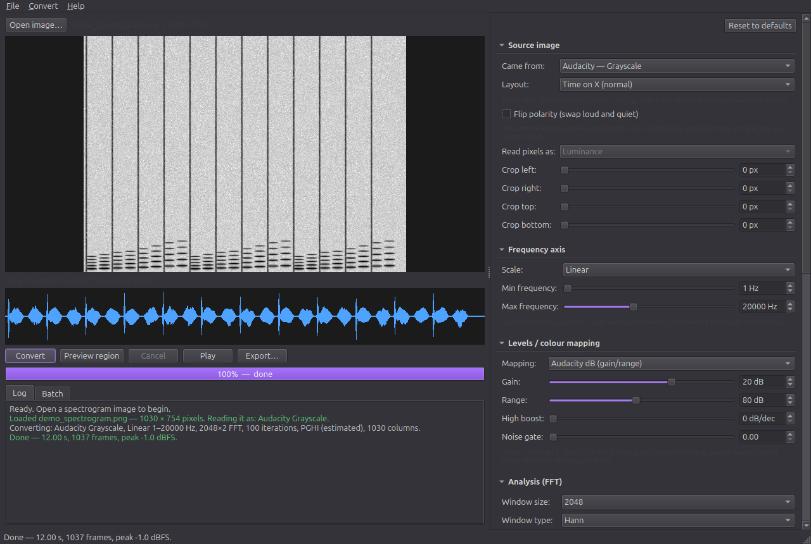

# Spectrogram to Audio

Turns pictures of spectrograms back into sound.

A spectrogram records how loud each frequency was at each moment. That is most
of what a sound is — but not the phase, the timing detail saying where each
wave started, which the picture throws away. This reconstructs the magnitudes
from the image, invents a plausible phase with Fast Griffin-Lim, and inverts
the transform.

The part that usually goes wrong is reading the picture, not the maths: every
tool draws with its own colour gradient and its own decibel curve, and guessing
either one wrongly produces noise. So **51 colour tables ship with it**, none
of them guessed:

- **Audacity's four**, derived from real exports and validated against them
- **ffmpeg's 15, SoX's 5 and Spek's**, read out of the colour bar each tool
  draws in its own legend
- **24 matplotlib maps**, taken from matplotlib itself

Nothing is auto-detected. You say where the image came from and it is read that
way — see [Nothing is guessed](#nothing-is-guessed).



There is a GUI with zoom, region previews and playback, and a CLI for scripting.

## Running it

```bash
./run.sh                          # open the GUI
./run.sh testing-files/image.png  # open the GUI with an image already loaded
```

Everything is installed in `venv/` inside this folder. To remove the project
completely, delete the folder — nothing is installed system-wide.

To rebuild the venv from scratch:

```bash
python3 -m venv --copies venv
venv/bin/pip install -r requirements.txt
```

There is also a headless mode:

```bash
./run.sh --cli testing-files/image.png -o out.mp3 --duration 1:23 --quality High
./run.sh --cli images/*.png --outdir audio/ --source viridis
./run.sh --cli image.png -o out.mp3 --source "Color (classic)" --scale Mel
./run.sh --cli --list-sources              # the catalogue, grouped and labelled
./run.sh --cli --list-schemes              # every gradient, by raw name
./run.sh --cli image.png -o clip.wav --from 0.2 --to 0.3 --denoise 10 --format wav
```

Tests: `venv/bin/python -m tests.test_roundtrip`

## The two things you have to get right

**1. The frequency axis.** Scale, Min and Max frequency must match what the
image was drawn with. These are the defaults the project ships: Linear,
1 Hz, 20000 Hz, matching Audacity's own dialog. Set Max frequency to the value used at export, *not* to where
the visible content stops — MP3-sourced spectrograms go blank above 15–16 kHz
but the axis still runs to 20 kHz. Getting the scale wrong warps pitch in a way
no speed adjustment can undo.

Set **Scale** to what you exported. The program does not try to work it out:
a spectrogram's axis genuinely cannot be read off the picture with confidence,
and Mel, Logarithmic, Bark and ERB warp it in such similar ways that they
cannot be told apart from each other at all.

**2. The duration.** A spectrogram image cannot tell you its own duration or
sample rate. Pixel width comes from the zoom level it was drawn at, not from
the hop size. So:

- If you know the length, type it in the Duration box as `1:23.5` or `83.5`.
  The result is then correct in both pitch and tempo.
- If you leave it blank, the program assumes one pixel column per FFT frame and
  tells you what that works out to. Then use **Time stretch** by ear. It works
  exactly like tape speed: it changes pitch and tempo together.

## Why it never sounds perfect

A spectrogram stores how loud each frequency was at each moment, and throws
away phase — the timing detail saying where each wave started. Phase has to be
invented, which is what Fast Griffin-Lim does: it transforms back and forth,
keeping your magnitudes and letting phase settle into something self-consistent.

But for images, **phase is no longer the main limit**. Measured on this
project's own test image, reconstruction error stops falling at about 0.17 no
matter how many iterations are spent, because no real sound has exactly the
spectrogram a quantised, resampled picture describes. The same measurement on a
true spectrogram reaches 0.014. That gap is the tinniness, and it comes from
the picture, not the algorithm.

**Set the window to whatever drew the image** — Hann for Audacity's default.
It is tempting not to: a Gaussian window has no sidelobes (measured, its worst
is −107 dB against Hann's −31 dB), so it smears far less energy into
neighbouring bins, Griffin-Lim has less invented phase to get wrong, and the
result genuinely sounds smoother and less robotic.

But smoother is not the same as more accurate. Measured against the original
audio — synthesise a signal, draw it as a Hann-based image the way Audacity
does, reconstruct, and compare spectra — a mismatched window costs real
fidelity:

| resynthesis window | error vs the original audio |
|---|---|
| Hann (what drew the image) | **0.76 dB** |
| Gaussian(a=3.5) | 2.44 dB |
| Gaussian(a=4.5) | 4.13 dB |

Reconstructing with a different window asks for a signal whose *Gaussian*-windowed
spectrogram matches a *Hann*-windowed magnitude, which is a mismatched model; it
answers by smoothing, and the smoothing takes real detail with the artefacts.

Beware of judging this by the fit error the program reports internally: that
compares the output against the target using the same window, so a wider-lobed
window is scored against a blurrier target and flatters itself. Across
different windows those numbers are not comparable.

**PGHI versus Random** is close to a wash on images — 0.76 dB against 0.75 dB.
PGHI does fit the target magnitudes better, but that does not make it closer to
the original sound. Its large win (about 47x) is on true spectrogram
magnitudes, whose gradients have not been blurred by resampling and flattened
to 8-bit.

What actually helps, in order:

1. **Match the FFT bin count to the image's rows.** The reference image has
   754 rows; zero padding 2 asks for 2049 bins, so two thirds of them are
   interpolation rather than information. Dropping to padding 1 measured
   *better* (0.163 vs 0.171) and 1.75x faster. The FFT panel shows the
   rows-to-bins ratio live so you can see when they are mismatched.
2. **Denoise**, which stops the reconstruction chasing background hiss.
3. **PGHI**, worth about 4% on images and far more on true spectrograms.
4. More iterations - the smallest effect of the four.

Counter-intuitively, **raising Overlap makes things worse** (0.239 at 8 versus
0.171 at 4): more overlap means more mutually redundant constraints, and an
inconsistent magnitude cannot satisfy them all.

Anything the picture clipped is also gone for good. With Gain 20 and Range 80,
the image only holds −100 dBFS to −20 dBFS; everything louder was flattened to
solid black when it was drawn.

## The settings

### Source image
| Setting | What it does |
|---|---|
| Came from | Which tool and colour scheme drew the image. Your choice — nothing is detected. |
| Layout | Whether time runs along the bottom (normal) or down the side (rotated). Some tools can draw either — ffmpeg's showspectrum will, and Spectrogrammer exposes it as Orientation. A rotated image read as a normal one is nonsense, not slightly wrong, because frequency becomes time. Both rotation directions are offered; pick whichever preview looks like a spectrogram. |
| Flip polarity | Swaps loud and quiet. The scheme already knows which end is which, so this is only for images that are the wrong way round anyway. |
| Read pixels as | Greyscale schemes only: how a pixel becomes one number. |
| Crop | Trims axis labels, rulers and borders that would otherwise be read as audio. |

#### Colour schemes

51 gradients ship with the program, and every entry in the picker uses a real
table — there is no "close enough" tier:

- **Audacity's four** — Grayscale, Inverse Grayscale, Color (default), Color
  (classic). The two colour tables were *derived from real exports* rather than
  guessed, by `tools/derive_audacity_luts.py`, using eight reference exports
  (four schemes × two frequency axes; see `testing-files/README.md`). Each table is derived
  by pairing a colour export against the greyscale export of the **same axis**:
  the greyscale one states outright how loud each point was, so colours can be
  ranked by loudness instead of guessed at from their geometry.

  Two checks keep that honest. The same scheme derived from its linear export
  and from its mel export must agree — they share nothing but the scheme, and
  they now match to within 6/255. And every table must fit its own export:
  worst case 1.9/255, against 187/255 for the wrong table.
- **24 matplotlib maps** — viridis, magma, inferno, plasma, turbo, jet, cividis,
  nipy_spectral and friends, lifted from matplotlib itself, so they are exact
  too.
- **ffmpeg's 15 `showspectrumpic` modes, SoX's 5, and Spek's 1**, extracted by
  `tools/extract_tool_palettes.py`, which gets each tool to draw a legend and
  reads the palette straight out of the colour bar. No constants transcribed
  from source, no guessing from screenshots. ffmpeg and SoX render to a file;
  Spek is a GUI with no batch mode, so it is run on an Xvfb virtual display and
  screenshotted — which also keeps its window off your desktop.

  **ffmpeg's modes are not the matplotlib maps they are named after.** Measured:
  its magma differs by 13/255, its plasma by 31, its terrain by 72, because it
  re-anchors each one to run black-to-white. This project assumed they matched
  until the tables were actually extracted and compared. Use the ffmpeg entries
  for ffmpeg images.
- **Plain greyscale**, either polarity.

Reading a colour image is done by nearest colour in the gradient, not by
brightness. That matters for rainbow maps such as jet and turbo, where the same
brightness occurs at several different levels and a brightness reading
scrambles them.

One caveat the reference data exposed: **Color (classic) is genuinely hard to
read back**. It runs pale blue-white → blue → magenta → red → pale pink-white,
so its two ends sit only 17/255 apart and a washed-out pixel could be silence
or full scale. From a lossless PNG those colours stay exactly distinct and it
works; from a JPEG or a rescaled screenshot they smear together and quiet
passages fill with noise. Prefer Grayscale or Color (default) where you have
the choice.

### Frequency axis
Scale supports Linear, Logarithmic, Mel, Bark, ERB and Period. Min and Max
frequency are the frequencies of the bottom and top pixel rows.

### Levels / colour mapping
`Audacity dB (gain/range)` reproduces that program's exact formula:

```
level = (dB + Range + Gain) / Range        drawing
dB    = level × Range − Range − Gain       what this program undoes
```

With Gain 20 and Range 80, white is −100 dBFS and black is −20 dBFS. The panel
shows this calibration live as you move the sliders. Raising **Gain** makes the
result quieter overall; raising **Range** lifts more quiet detail out of the
floor. **Noise gate** forces near-silent levels to true silence, which helps
when a background is light grey rather than pure white — the reference image
sits at level 0.16, not 0.00.

The other mappings (`Plain dB range`, `Linear amplitude`, `Linear power`) are
for images from tools that did not use a gain/range curve.

### Analysis (FFT)
Window size and window type should match the export. **Zero padding** and
**Overlap** are resynthesis choices, not properties of the picture: padding
sets how many FFT bins the image is resampled onto, and hop = window ÷ overlap.
The panel shows how the image's row count compares to the bin count, which is
the number worth watching — see "Why it never sounds perfect" above. Measured
best on real images: padding 1, overlap 4.

### Phase reconstruction

**Quality** sets the three phase controls together. Pick a level and ignore the
rest; touching any of them individually moves the box to Custom.

| Quality | Iterations | Start |
|---|---|---|
| Draft | 16 | PGHI |
| Fast | 32 | PGHI |
| Balanced | 100 | PGHI |
| High | 300 | PGHI |
| Maximum | 600 | PGHI |
| Classic Griffin-Lim | 200 | random, no momentum |

| Setting | Notes |
|---|---|
| Iterations | More is cleaner and slower. Returns diminish past about 300. |
| Momentum | 0 is classic Griffin-Lim. 0.99 is Fast Griffin-Lim, roughly three times quicker for the same quality. Above 1 is unstable, so it is clamped. |
| Initial phase | PGHI by default - see below. Random, Zero and Linear ramp are also available. |
| Random seed | Same seed, same output. |

**PGHI** (Phase Gradient Heap Integration) estimates a starting phase from the
spectrogram's own gradients instead of from noise: for a Gaussian-like window
the phase's rate of change in time is fixed by the log magnitude's slope in
frequency, and vice versa, so phase can be integrated outwards from the loudest
bin. Measured on a true spectrogram it reaches at **zero** iterations
(convergence 0.05) what random phase needs about 40 iterations to reach, and
PGHI + 32 iterations beats random + 200.

### Denoise

Attenuates each frequency bin by how close it sits to *its own* noise floor,
estimated as a low percentile over time. Doing it per bin matters - a picture's
background is not flat, and a single global threshold eats quiet high
frequencies while leaving low rumble alone.

It runs on the magnitudes *before* phase reconstruction, so Griffin-Lim never
has to invent phase for hiss - which is where much of the watery quality comes
from.

### Preview region

Drag across the image to mark a time region. **Preview region** converts just
that, at draft quality, and plays it - a few seconds finishes in well under a
second, against ~15 s for a full image. **Convert** honours the same region, so
you can tune by ear on a short passage and then clear the selection (a single
click) for the real run.

### Output
MP3 (libsndfile, falling back to ffmpeg), WAV, FLAC and OGG. Normalize sets the
peak to your target; the fade removes the click at each end.

## Nothing is guessed

You tell the program where an image came from; it never tries to work that out
for itself. There are two choices, and they are independent:

**Came from** (Source image panel) — the tool and colour scheme that drew it.
Each entry says how trustworthy its gradient is:

| Group | Accuracy |
|---|---|
| Audacity — Color (default), Color (classic), Grayscale, Inverse Grayscale | **exact**, derived from real exports |
| matplotlib / librosa / Python — viridis, magma, inferno, plasma, cividis, turbo, jet, gray + 16 more | **exact**, lifted from matplotlib |
| ffmpeg `showspectrumpic` — all 15 modes | **exact**, read out of ffmpeg's own legend colour bar |
| SoX `spectrogram` — default, `-l`, `-m`, `-m -l`, `-h` | **exact**, read out of SoX's own colour bar. Also sets SoX's documented level calibration (120 dB range topping out at 0 dBFS) |
| Spek | **exact**, read out of Spek's legend by screenshotting it on a virtual display. Also sets its 0 to −120 dB calibration |
| Greyscale either polarity, and "any picture → sound" | generic |

**Scale** (Frequency axis panel) — Linear, Logarithmic, Mel, Bark, ERB or
Period. Every source can draw on any axis, so this is a separate control rather
than a combined list six times longer.

### Looking at the image

| action | does |
|---|---|
| wheel | zoom about the pointer |
| middle-drag, or shift with the left button | slide the view |
| double-click | back to fit |
| left-drag | mark a time region for the preview |

The window never resizes itself: a wide image is scaled to fit, and zooming
magnifies inside the same frame rather than growing it.

**Reset to defaults**, top right, restores the Audacity dialog values this
project was built around: Grayscale, Linear, 1–20000 Hz, Gain 20, Range 80,
Hann 2048, zero padding 2.

Entries that merely borrowed a similar-looking gradient — Sonic Visualiser,
Adobe Audition, iZotope RX — were removed. Each was an alias for a matplotlib
map already in the list, so it added no capability; all it added was a tool's
name implying a verification that had not happened. Audition and RX let you
reconfigure their palettes anyway, so even a "correct" table would often be
wrong.

**If your image came from a tool that is not listed**, either pick the
closest-looking gradient from the 49, or export the same audio from that tool
twice — once monochrome, once in colour — and its exact table can be derived
from the pair, the way Audacity's were.

## Layout

```
main.py              entry point (GUI, or --cli)
run.sh               launcher that uses the venv
spectro/settings.py  every tunable, its default, and the quality presets
spectro/colormap.py  colour gradients: reading levels out of pixels
spectro/sources.py   the catalogue of tools and schemes you pick from
spectro/colormaps.npz  24 exact matplotlib gradients (22 KB)
spectro/audacity.npz   Audacity's four, derived from real exports
spectro/tools.npz      ffmpeg's 15, SoX's 5 and Spek's, read from their legends
spectro/core.py      image → magnitude → Fast Griffin-Lim → samples
spectro/audio_io.py  export and playback
spectro/gui.py       the window
spectro/widgets.py   slider+spinbox, collapsible sections, waveform view
spectro/cli.py       headless mode
tests/               round-trip and unit checks (119 of them)
tools/derive_audacity_luts.py   rebuilds audacity.npz from testing-files/
tools/extract_tool_palettes.py  rebuilds tools.npz by running ffmpeg and sox
```

`file.py` at the top level is the empty placeholder this project started from;
nothing uses it and it can be deleted.

## Requirements

Python 3.10 or newer, and the packages in `requirements.txt` (numpy, scipy,
Pillow, PyQt6, soundfile, sounddevice) — all pip-installable into the venv,
nothing system-wide. `ffmpeg` is optional and only used as a fallback for MP3
export; the bundled libsndfile handles MP3 on its own.

Rebuilding the bundled colour tables additionally needs `ffmpeg` and `sox` on
PATH, plus `spek`, `xdotool` and `Xvfb` for the Spek entry. You never need
these to *use* the program — the tables are committed.

## Accuracy

Two kinds of check. `tests/test_roundtrip.py` synthesises audio, draws it into
a PNG the way Audacity would, reads that PNG back and compares — and separately
checks the colour tables against eight real Audacity exports, when they are
present. Each table fits its own export to within **1.9/255** while
the wrong table scores **187/255**, and every table reads the same off a linear
export as off a mel one.

The synthetic half tests the maths. The real half matters because a synthetic
image is drawn with the same table it is then read back with, so it can only
ever catch a coding mistake — never a wrong table. Currently the recovered
spectrum matches the original to a mean error of **0.7 dB** across the whole
80 dB range, with a level-domain correlation of **0.995**, and every tone lands
within 2 dB. It also checks perfect STFT/ISTFT reconstruction for all nine
window types, monotonic behaviour for all six frequency scales, that no loud
burst appears at the start or end, that every bundled colour table inverts to
within 0.001, that a wrong table fits far worse than the right one, and that
PGHI beats random phase.
